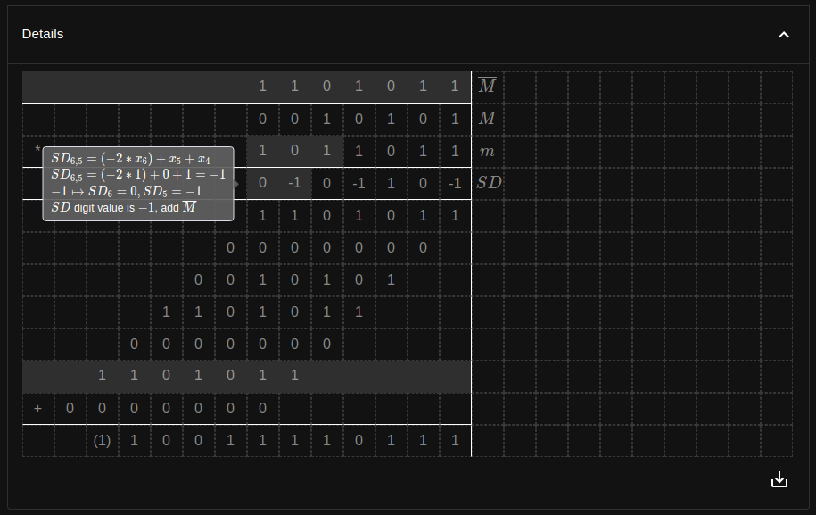

# CALC
CALC *(Computer Arithmetic Learning Calculator)* is a set of tools and theory docs for solving exercises from AK1 course.
It's a fully in-browser application currently hosted at [github pages of this repo](https://jakubsokolowski.github.io/calc-web/#/).

## Features
### Positional arithmetic
Positional arithmetic for different bases (2-99) and representations (positional, complement):
- base conversion
- base conversion using associated bases
- complement conversion
- arithmetic operations
    - addition
    - subtraction
    - multiplication
        - with complement extension
        - without complement extension
        - Booth algorithm (U2)
        - Booth-McSorley algorithm (U2)
        - Booth-McSorley alternative algorithm (U2)
    - division
### Floating arithmetic
- IEEE-754 format explorer (under construction)
