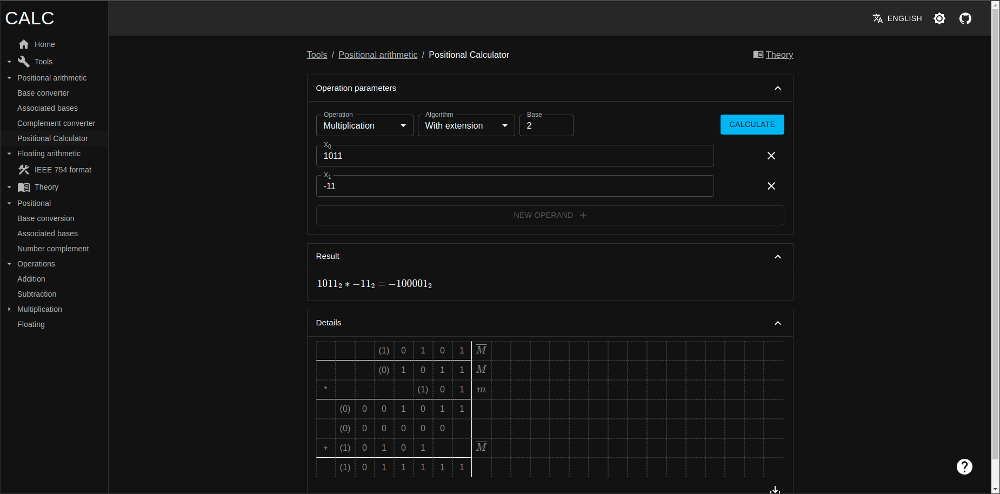

# CALC
CALC *(Computer Arithmetic Learning Calculator)* is a set of tools and theory docs for solving exercises from AK1 course.
It's a fully in-browser application currently hosted at [github pages of this repo](https://jakubsokolowski.github.io/calc-web/#/).

## Features
### Positional arithmetic
Positional arithmetic for different bases (2-99) and representations (positional, complement):
- base conversion
- base conversion using associated bases
- complement conversion
- arithmetic operations
    - addition
    - subtraction
    - multiplication
        - with complement extension
        - without complement extension
        - Booth algorithm (U2)
        - Booth-McSorley algorithm (U2)
        - Booth-McSorley alternative algorithm (U2)
    - division
### Floating arithmetic
- IEEE-754 format explorer (under construction)
## Development
Running CALC requires node (version 14, may work on later) and yarn. Install dependencies with yarn:
```
yarn install
```
Start dev server. Application will open at  http://localhost:4200/
```
npm run start
```
### Repo structure
This repo is managed by [nx](https://nx.dev/). The bulk of the code is in `apps` and `libs` folders:
- `apps`
    - `calc-web`: main application
    - `calc-web-e2e`: cypress e2e tests for calc-web
- `libs`
    - `base-converter`: [base converter](https://jakubsokolowski.github.io/calc-web/#/tools/positional/base-converter) 
    and [associated-base converter](https://jakubsokolowski.github.io/calc-web/#/tools/positional/associated-base-converter) views components for calc-web
    - `calc-arithmetic`: base-conversion and arithmetic operations algorithms or positional and floating arithmetic 
    - `calc-rs`: rust experiments with wasm, unused at the moment
    - `common-ui`: themes, common-ui components for different views
    - `core`: redux store for `calc-web`
    - `docs`: theory docs (files in `docs/src/assets` folder) and components for displaying them
    - `float-converter`: IEEE 754 [format explorer view](https://jakubsokolowski.github.io/calc-web/#/tools/floating/float-converter), unfinished
    - `grid`: components and utils for grids used for operation result visualization
    - `i18n`: translation files and utils
    - `positional-calculator`: [calculator view](https://jakubsokolowski.github.io/calc-web/#/tools/positional/positional-calculator) for positional arithmetic operations
    - `positional-ui`: common ui components for handling positional numbers
    - `utils`: various util functions and hooks used in libs
    
### Running tests
To run tests/lints/other for specific lib/app use `nx test libname`, ex:
```
nx test calc-arithmetic
```
To run [cypress](https://www.cypress.io/) e2e tests start cypress using:
```
npm run e2e-watch
```
And chose which spec to run in cypress window.

## Acknowledgements
Many thanks to Mr. K for AK1 course notes, without which this project (or for me - even passing AK1 course) would not be possible. 
Most of the implemented algorithms in CALC are based on those notes. His website (now archived) can be found [here](https://web.archive.org/web/20101116091940/http://mr-k.namyslow.eu.org/studia/arytmetyka.html).
