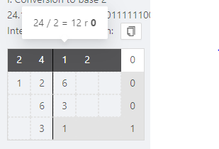

# Konwersja podstaw
## Konwersja części dziesętnej

Powiedzmy że chcemy przekonwertować liczbę z bazy 10 na bazę 2. Libczę w danej bazie będziemy oznaczać przez wartość z dołu liczby, tak więc liczba 24 w podstawie 10 oznaczamy jako $24_{10}$. Konwersje z jednej podstawy na inną będziemy oznaczać jako $24_{10}=(?)_{2}$.   Z dowolnej liczby o podstawie 10, można otrzymać liczbę o dowolnej innej podstawie przez dzielenie tej liczby przez podstawę do której chcemy przekonwertować. Resztą z takiego dzielenia jest cyfra na pozycji, a wynikiem dzielenia jest wejście do kolejnego kroku. W czasie procesu dzielenia otrzymujemy kolejne cyfry wyniku "od końca".  Konwersja do podstawy 2 dla $24_{10}$ wygląda następująco: 

$Podstawa = Dzielnik = 2$

1. $24 : 2 = 12 r 0$
2. $12 : 2 = 6 r 0$
3. $6 : 2 = 3 r 0$
4. $3 : 2 = 1 r 1$

Kiedy otrzymamy wynik dzielenia który jest mniejszy niż podstawa, algorytm się zatrzymuje.
Wynik konwersji to $24_{10}=(11000)_{2}$. Można go odczytać następująco: cyfry wyniku zostały otrzymywane w odwrotnej kolejnośći (najmniej znaczące najpierw) więc żeby odczytać wynik trzeba iść górę. Ostatni wynik z dzielenia też należy do wyniku całkowitego → jest to pierwsza cyfra. Można łatwo zapamiętać kolejność wizualnie, zaczynająć od wyniku ostatniego dzielenia wziąć wszystko z prawej, a potem do góry.

W CALC widok wykonywania konwersji wygląda mniej więcej tak jak po prawej. Po wpisaniu w formularze liczby którą chcemy przeknowertować, jej podstawy oraz podstawy na którą chcemy przekonwertować, pojawi sie wynik, uzupełnienie wyniku, oraz rozpisane kroki konwersji. Wynik w krokach jest zaznaczony na ciemniejszy odcień szarego. 

Pionowa linia symbolizuje podział przez podstawę wyniku, po liczba którą dzielimy, a po lewej wynik dzielenia. Na samym końcu danego rzędu, zaznaczaona jest reszta z dzielenia ( wynik na danej pozycji).

## Konwersja części ułamkowej

Konwersja ta odbywa się za pomocą mnożenia. Bierzemy ułamek w danej podstawie i mnożymy przez bazę docelową. Wynik na pozycji to pierwsza cyfra przed przecinkiem. Następnie, bierzemy z wyniku tylko część ułamkową. Na przykładzie $0.123_{10} = (?)_{2}$ z dokładnością 5 cyfr po przecinku:

1. $0.123 * 2=0.246$ → mnożymy przez baze, pierwsza cyfra przed przecinkiem (0), wywalamy wszystko przed przecinkiem, do następnego kroku przechodzi 0.246
2. $0.246 * 2 = 0.492$ → mnożymy jeszce raz, (0), przechodzi 0.492
3. $0.492 * 2 = 0.984$ → mnożymy jeszcze raz, (0), przechodzi 0.984
4. $0.984 * 2 = 1.968$ → mnożymy jeszcze raz, (1), przechodzi 0.986
5. $0.986 * 2 = 1.936$ → mnożymy jeszce raz, (1), przechodzi 0.936
6. ....
7. Powtarzamy to tak długo aż uzyskamy pożądaną dokładność, lub wykyryjemy powtarzające się rozszerzenie ( za każdym razem dostajemy taką sam wynik mnożenia), wtedy ułamek jest okresowy. W tym przykładzie, wynik konwersji z dokładnością do 5 miejsc po przecinku wyniesie $0.123_{10}=0.0011$.
8. Algorytm kończy się również gdy otrzymamy wynik z zerową częścią ułamkową, np. kiedy chcemy przekonwertować $0.5_{10} = (?)_{2}$. W pierwszym kroku otrzymamy wtedy $0.5 * 2 = 1.0$, bierzemy 1 jako pierwszą cyfrę ułamka, do następnego kroku przechodz 0, a każde kolejne mnożenie też da 0.

# Konwersja z dowolnej bazy na dowolną bazę

Konwersję z dowolnej na dowolną bazę przeprowadzamy w 2 krokach. Pierwszym krokiem jest konwersja do bazy 10. Można taką konwersję łatwo wykonać poprzez pomnożenie wartości każdej cyfry liczby przez $baza^{waga}$, gdzie wagą liczby jest pozycja cyfry, a następnie zsumowanie wszystkich rezultatów. Na przykładzie liczby $AFFB.C_{16}$:

$$A * 16^3 + F*16^2 + F*16^1 + B*16^0 + C * 16^{-1} = 45051.75
$$

# Konwersja przez bazy skojarzone

W specyficznych przypadkach można znacząco uprościć konwersję. Przypadki te to takie gdy baza do której konwertujemy jest n-tą potęgą bazy z której konwertujemy, albo na odwrót. Na przykład, można takiej metody użyć dla $(X)_{2} = (Y)_{8} = (Z)_{64}$.

Przez zależności między potęgami, cyfrze w liczbie o mniejszej podstawie (A), po konwersji na większą podstawę (B) będzie przypadało $n = log_A(B)$ cyfr. Dla takich konwersji grupujemy cyfry w kolejne grupy o wielkości n, zaczynając od przecinka w lewo i w prawo. Dla ostatniej grupy może nam nie starczyć cyfr, wtedy zawsze wpisujemy 0.Przykładowo, jeśli chcemy skonwertować liczbę $1110100110.11_{2}$ na podstawę 8, każde $log_2(8) = 3$ cyfry liczby o podstawie 2 będą odpowiadały jednej cyfrze w podstawie 8. Pierwszym krokiem jest zgrupowanie cyfr po 3.

1. $1|110|100|110|.|11$→ mamy 2 grupy niepełne wstawiamy 0 aż otrzymamy 3 cyfry
2. $001|110|100|110|.|110$ → dla każdej grupy odczytujemy wartość w systemue 10 z grupy, i przypisujemy tej wartości cyfrę z (8) 
    1. $001_{(2)} = 1_{(10)} = 1_{(8)}$
    2. $110_{(2)} = 6_{(10)} = 6_{(8)}$
    3. $100_{(2)} = 4_{(10)} = 4_{(8)}$
    4. $110_{(2)} = 6_{(10)} = 6_{(8)}$
    5. $110_{(2)} = 6_{(10)} = 6_{(8)}$

    Ostateczny wynik to 1646.6

Przy konwersji z większej bazy na mniejszą odwracamy proces, każdej cyfrze wejścia przypisujemy n cyfr wyjścia i konwertujemy.

Dlaczego jest to przydatne? Powiedzmy że chcemy przekonwertować liczbę z podstawy 64 na podstawę 2, gdybyśmy chcieli zrobić to normalnie musielibyśmy wielokrotnie podzielić daną liczbę przez 2, co zwiększa ryzyko błędu. Dzielenie jest najbardziej skomplikowaną operacją W takim przypadku jest lepiej użyć 2 razy baz skojarzonych: $64 \rightarrow 8 \rightarrow 2$. Omijamy wtedy dzielenie zupełnie.
